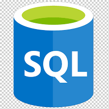
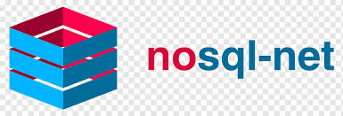

<h1> Hola, Un gusto verte!!!.</h1>

Bienvenidos a mi Pagina!   Soy Vargas Victor, Data Science, Soy de  <b>Buenos Aires, Argentina</b>

<h3>About Me</h3>

Data Science con amplia experiencia en Python, SQL y Spark, además de trabajo en la nube con Azure, AWS y Google 
Cloud junto con las herramientas de automatización como Data Factory y Airflow. He desarrollado proyectos bajo 
metodologías ágiles (Scrum), lo cual me ha permitido aplicar soft skills como lo son el análisis de datos, solución de 
problemas y trabajo colaborativo.

<h3>Mi Stack tegnologico</h3>

 
  
  
  
  
  
  
  
  
  
  
  
  
  
  

<h3>Mis Proyectos</h3>
<table>
  <thead align="center">
    <tr border: none;>
      <td><b>🎁 Projects</b></td>
    </tr>
  </thead>
  <tbody>
    <tr>
      <td><a href="https://github.com/Victor624/Plataforma_Straming"><b>Plataforma de Streaming</b></a></td>
    </tr>
	  <tr>
      <td><a href="https://github.com/Victor624/Mercado_Cripto"><b>Mercado Crypto</b></a></td>
    <tr>
      <td><a href="https://github.com/Victor624/PF_DS_REVIEWS_AND_RECOMMENDATIONS"><b>Recomendacion de Franquicias en EEUU</b></a></td>
  </tbody>
</table>

<h3>Proyectos en proceso</h3>
<table>
  <thead align="center">
    <tr border: none;>
      <td><b>🎁 Projects</b></td>
    </tr>
  </thead>
  <tbody>
    <tr>
      <td><a href="https://github.com/Victor624/Costo_Medico"><b>Costo Medico</b></a></td>
  </tbody>
</table>

<h3>En donde me encuentras</h3>

   

------------

This <i>README</i> file is generated <b>every 3 hours</b>! Last refresh: Sunday, 31 December, 13:01 CET <a href="https://medium.com/@th.guibert/how-to-create-a-self-updating-readme-md-for-your-github-profile-f8b05744ca91">Create your own here!</a>

  

